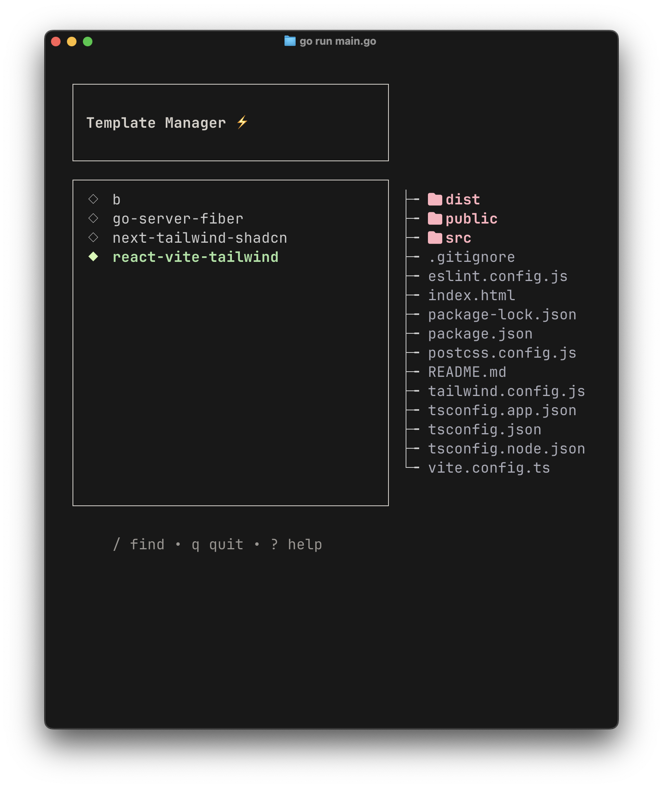
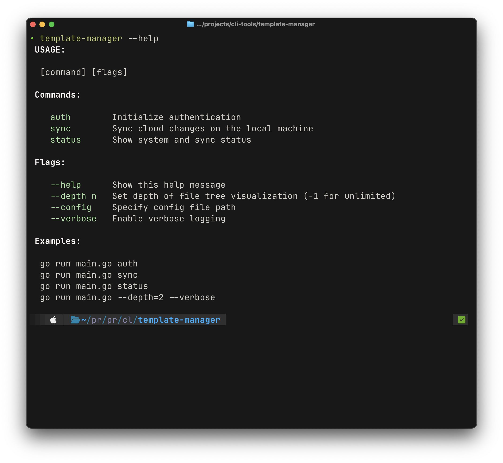

# OPEN TEMPLATE

# Preview



## Setup

1. Clone the Repo

```
git clone https://github.com/singhxayush/open-template.git
cd open-template
```

2. Edit the location under main.go for desired absolute location to host your templates

3. Build the project: go build .

4. Run the build with: ./open-template

## Commands

1. Help Command

```sh
# to know all the commands
open-template --help
```

output:

